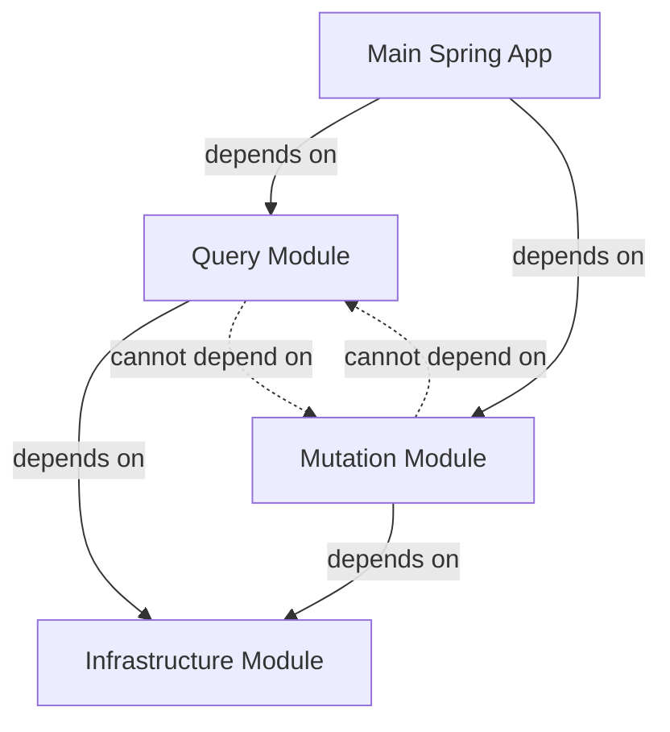

# 4. Gradle Module Structure: Query and Mutation Separation

Date: 2025-12-16

## Status

Proposed

## Context

As we move into Phase 2 (mutations), we need a clear architectural separation between:
- **Query operations**: Read-only, use projections/DTOs, aggregate from upstream APIs
- **Mutation operations**: Write operations, use DDD aggregate roots, enforce invariants, publish events

Without clear separation, we risk:
- Query code accidentally calling mutation code (or vice versa)
- Dependencies bleeding between read and write concerns
- Difficulty enforcing architectural boundaries
- Confusion about which patterns to use where
- Tight coupling that makes testing and maintenance harder

Traditional package-based separation within a single module can be easily violated. Developers might accidentally create dependencies between query and mutation packages, and these violations are only discovered at runtime or through code reviews.

## Decision

We will use **Gradle modules** to enforce strict separation between query and mutation operations, following a CQRS (Command Query Responsibility Segregation) structure:

### Module Structure

```
sas-service/
├── mutation/
│   └── src/main/kotlin/
│       └── mutation app (DDD aggregate roots, domain logic)
├── query/
│   └── src/main/kotlin/
│       └── query app (projections, DTOs, orchestration)
├── infrastructure/
│   └── src/main/kotlin/
│       └── common code (repos, entities, shared utilities)
└── src/main/kotlin/
    └── main Spring app (configuration, dependency injection)
```

### Module Dependencies



**Dependency Rules**:
- **Main app** depends on both `query` and `mutation` modules
- **Query module** depends on `infrastructure` only
- **Mutation module** depends on `infrastructure` only
- **Infrastructure module** has no dependencies on `query` or `mutation`
- **Query and mutation modules cannot depend on each other**

### Module Responsibilities

#### Query Module (`query/src/main/kotlin`)

**Purpose**: Handle all read-only operations

**Contains**:
- Query services (e.g., `CaseQueryService`, `ProfileQueryService`)
- Orchestration services (e.g., `CaseOrchestrationService`)
- Aggregator service usage (from infrastructure or separate aggregator module)
- DTOs and projections for read operations
- Read-only repository interfaces (if needed)
- Controllers for query endpoints (or in main app)

**Patterns Used**:
- API Aggregation Pattern (ADR-0003)
- DTOs for data transformation
- Projections for read models
- No aggregate roots or domain entities

**Example Structure**:
```kotlin
query/
  service/
    CaseQueryService.kt
    ProfileQueryService.kt
  orchestration/
    CaseOrchestrationService.kt
  dto/
    CaseDto.kt
    ProfileDto.kt
```

#### Mutation Module (`mutation/src/main/kotlin`)

**Purpose**: Handle all write operations

**Contains**:
- Aggregate roots (e.g., `CaseAggregate`)
- Domain entities and value objects
- Domain events
- Mutation services (e.g., `CaseMutationService`)
- Command handlers
- Domain logic and business rules
- Controllers for mutation endpoints (or in main app)

**Patterns Used**:
- DDD Lite (ADR-0001)
- Aggregate roots for domain logic
- Outbox pattern for events (ADR-0002)
- Hydration from upstream APIs (via infrastructure)

**Example Structure**:
```kotlin
mutation/
  domain/
    aggregate/
      CaseAggregate.kt
    event/
      CaseCreatedEvent.kt
    valueobject/
      Address.kt
      OffenceId.kt
  service/
    CaseMutationService.kt
  command/
    UpdateCaseCommand.kt
```

#### Infrastructure Module (`infrastructure/src/main/kotlin`)

**Purpose**: Shared code used by both query and mutation modules

**Contains**:
- Repository implementations (JPA repositories)
- Database entities (JPA entities)
- Shared utilities and helpers
- External API clients (if shared)
- Database configuration
- Common exceptions and error handling
- Shared value objects (if not domain-specific)

**Patterns Used**:
- JPA for persistence
- Repository pattern
- Shared infrastructure concerns

**Example Structure**:
```kotlin
infrastructure/
  persistence/
    entity/
      CaseEntity.kt
    repository/
      CaseRepository.kt
  client/
    Client.kt // the real api clients?
  config/
    DatabaseConfig.kt
  util/
    Mapper.kt // common utils
    DateFormatter.kt // for example
```

#### Main Spring App (`src/main/kotlin`)

**Purpose**: Application entry point and configuration

**Contains**:
- Spring Boot application class
- Configuration classes
- Dependency injection setup
- REST controllers (or delegate to query/mutation modules)
- API endpoints
- Security configuration
- Health checks

**Patterns Used**:
- Spring Boot conventions
- Dependency injection
- REST API configuration

**Example Structure**:
```kotlin
application/
  SasApplication.kt
  config/
    AppConfig.kt
    SecurityConfig.kt
api/
  controller/
    CaseController.kt
    ProfileController.kt
```

### How Queries Use Projections

Query operations follow the pattern established in ADR-0003:

### How Mutations Use DDD

Mutation operations follow the pattern established in ADR-0001:

## Consequences

### Benefits

- **Strict separation**: Gradle enforces dependency rules at build time - violations are caught immediately
- **Clear boundaries**: Developers know exactly where query vs mutation code belongs
- **No accidental dependencies**: Cannot accidentally import mutation code in query module (or vice versa)
- **Easy to spot violations**: Build fails if someone tries to create forbidden dependencies
- **Independent evolution**: Query and mutation modules can evolve independently
- **Clear patterns**: Query uses projections, mutation uses DDD - no confusion
- **Better testing**: Can test query and mutation logic independently
- **Infrastructure reuse**: Common code (repos, entities) shared without coupling

### Trade-offs

- **Build complexity**: More Gradle modules to manage
- **Dependency management**: Need to carefully manage dependencies between modules
- **Potential duplication**: Some code might need to exist in both modules (though infrastructure should minimize this)
- **Learning curve**: Team needs to understand module boundaries and dependency rules
- **Refactoring overhead**: Moving code between modules requires updating dependencies

### Alignment with Previous ADRs

This structure directly supports the architectural decisions made in previous ADRs:

**ADR-0001 (DDD Lite)**:
**ADR-0002 (Outbox Pattern)**:
**ADR-0003 (API Aggregation)**:

### Implementation Considerations

- **Aggregator Module**: Consider if aggregator should be a separate module or part of infrastructure
- **Shared DTOs**: Some DTOs might be needed by both query and mutation - consider infrastructure or separate `api` module
- **Controller Location**: Controllers can be in main app (delegating to query/mutation) or in respective modules
- **Testing**: Each module should have its own test directory with module-specific tests
- **Documentation**: Document module boundaries and dependency rules clearly
- **Code Review**: Reviewers should check that dependencies follow the rules

