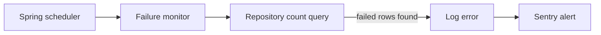

# Alerting

This document explains how the service detects failed rows in background tables and sends alerts to Sentry.

## Overview

The service uses lightweight scheduled monitors to look for rows in a `FAILED` state and raise a single Sentry alert when failures are present.

This pattern is used for:

- inbox events
- outbox events
- case refresh requests



## How it works

Each monitor follows the same basic flow:

1. Run on a cron schedule
2. Acquire a ShedLock lock so only one pod executes the job
3. Count the number of failed rows using a repository method
4. Exit quietly if the count is zero
5. Log an error and send one Sentry message if failed rows exist

This keeps the alerting simple and avoids sending one alert per failed row.

## Monitors

### Inbox event failures

- Counts rows with `processedStatus = FAILED`
- Sends an alert if any failed inbox events are found
- Implementation: `InboxEventFailureMonitor`

### Outbox event failures

- Counts rows with `processedStatus = FAILED`
- Sends an alert if any failed outbox events are found
- Implementation: `OutboxEventFailureMonitor`

### Case refresh request failures

- Counts rows with `status = FAILED`
- Sends an alert if any failed case refresh requests are found
- Implementation: `CaseRefreshFailureMonitor`

## Scheduling

The monitors are currently configured to run **daily at midday UTC**:

```yaml
cron: "0 0 12 * * *"
zone: UTC
```

This means the alert check runs once per day, which is enough for a lightweight operational signal without creating noise.
This will require updating to run more frequently once processes have been established.

## ShedLock

The app runs with multiple replicas, so the monitors must only execute once across the cluster. ShedLock is used for that.

Current lock settings are intentionally conservative:

- `lock-at-most-for`: `PT30M`
- `lock-at-least-for`: `PT5M`

These values mean:

- the lock is released automatically if the job hangs or the pod dies
- the lock stays held for a short minimum period to prevent duplicate execution from closely timed scheduler ticks

## Sentry behaviour

When a monitor finds failed rows, it sends a message through `SentryService.captureErrorMessage(...)`.

The alert message includes the number of failed rows, for example:

- `Detected 2 failed inbox event(s)`
- `Detected 1 failed outbox event(s)`
- `Detected 3 failed case refresh request(s)`

This gives a quick operational signal without exposing the full row contents.

## Configuration

Relevant settings live in `src/main/resources/application.yml`:

- `inbox-events.failed-monitor.cron`
- `inbox-events.failed-monitor.zone`
- `outbox-events.failed-monitor.cron`
- `outbox-events.failed-monitor.zone`
- `case-refresh.failed-monitor.cron`
- `case-refresh.failed-monitor.zone`
- `shedlock.inbox-event-failure-monitor.*`
- `shedlock.outbox-event-failure-monitor.*`
- `shedlock.case-refresh-failure-monitor.*`

## Source files

- [InboxEventFailureMonitor.kt](/mutation/src/main/kotlin/uk/gov/justice/digital/hmpps/singleaccommodationserviceapi/mutation/domain/processor/InboxEventFailureMonitor.kt)
- [OutboxEventFailureMonitor.kt](/mutation/src/main/kotlin/uk/gov/justice/digital/hmpps/singleaccommodationserviceapi/mutation/domain/processor/OutboxEventFailureMonitor.kt)
- [CaseRefreshFailureMonitor.kt](/mutation/src/main/kotlin/uk/gov/justice/digital/hmpps/singleaccommodationserviceapi/mutation/domain/processor/CaseRefreshFailureMonitor.kt)
- [application.yml](/src/main/resources/application.yml)
- [InboxEventDispatcher.md](/docs/components/InboxEventDispatcher.md)

