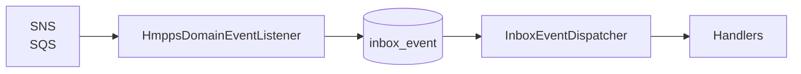

# Inbox Event Dispatcher

This document explains how the Inbox Event Dispatcher works, how to configure it, and how to add new handlers.

## Overview

The Inbox Event Dispatcher processes domain events from the inbox table. Events arrive via SQS/SNS, are persisted to the inbox by `HmppsDomainEventListener`, and are then processed asynchronously by the dispatcher on a schedule.



## What It Does

1. **Fetches** pending events from the inbox, ordered by `eventOccurredAt` ascending (oldest first)
2. **Partitions** events by a key (e.g. CRN) so that events for the same resource are never processed concurrently
3. **Processes** each partition in parallel using Kotlin coroutines, with a semaphore limiting how many partitions run at once
4. **Within each partition**, events are processed sequentially in `eventOccurredAt` order

## Why Partition by CRN?

**One CRN per thread** (or more precisely, one partition key per coroutine) is required because OAsys and similar systems return **fat events**—the data to update is contained within the event payload itself. When multiple events for the same CRN are processed concurrently, they can:

- Create duplicate case rows (race condition on insert)
- Overwrite each other's updates (last-write-wins)
- Some events do not use callback urls, for example OASys events are fat events, and store the change in the message.

By partitioning on CRN, we ensure that all events for a given person (CRN) are processed sequentially in the order they occurred. Different CRNs are processed in parallel, so throughput is maintained.

## Configuration

Configure via `application.yml` or environment variables:

```yaml
hmpps:
  sqs:
    dispatcher:
      max-events-per-batch: 10    # How many events to fetch per scheduler run (default: 10)
      max-concurrent-events: 4    # Max partitions processed in parallel (default: 4)
```

| Property | Description | Default |
|----------|-------------|---------|
| `hmpps.sqs.dispatcher.max-events-per-batch` | Number of pending events to fetch per process run | 10 |
| `hmpps.sqs.dispatcher.max-concurrent-events` | Maximum number of partitions (e.g. CRN groups) processed concurrently | 4 |

The dispatcher runs on a schedule (every 5 seconds, after the previous run completes) and uses ShedLock to ensure only one instance processes at a time in multi-instance deployments.

## Adding a New Handler

To handle a new event type, follow these steps:

### 1. Add the event type to the enum

In `IncomingHmppsDomainEventType.kt`:

```kotlin
enum class IncomingHmppsDomainEventType(
  val typeName: String,
  val typeDescription: String,
) {
  TIER_CALCULATION_COMPLETE(
    "tier.calculation.complete",
    "Tier calculation complete from Tier service",
  ),
  MY_NEW_EVENT(                    // Add your event type
    "my.new.event.type",
    "the description is found within the event message",
  ),
  ;
  // ...
}
```

### 2. Create the handler class

Create a new class implementing `InboxEventHandler` in the `handler` package:

```kotlin
@Component
class MyNewEventHandler(
  private val inboxEventRepository: InboxEventRepository,
  // inject any services you need
) : InboxEventHandler {

  override fun supportedEventType() = IncomingHmppsDomainEventType.MY_NEW_EVENT

  override fun getPartitionKey(inboxEvent: InboxEventEntity): String? {
    // Return the partition key (e.g. CRN) if events for the same key must be serialised.
    // Return null if each event can be processed independently.
    val payload = jsonMapper.readValue(inboxEvent.payload, MyEventPayload::class.java)
    return payload.crn  // or null for no partitioning
  }

  @Transactional
  override fun handle(inboxEvent: InboxEventEntity) {
    try {
      val payload = jsonMapper.readValue(inboxEvent.payload, MyEventPayload::class.java)
      // Your business logic here - update domain, call services, etc.
      
      inboxEvent.processedStatus = ProcessedStatus.SUCCESS
      inboxEvent.processedAt = Instant.now()
      inboxEventRepository.save(inboxEvent)
    } catch (e: Exception) {
      log.error("Failed to process event [inboxEventId={}]", inboxEvent.id, e)
      inboxEvent.processedStatus = ProcessedStatus.FAILED
      inboxEvent.processedAt = Instant.now()
      inboxEventRepository.save(inboxEvent)
    }
  }
}
```

### 3. Register the SQS filter (if needed)

If the event comes from SQS, ensure the queue subscription filter includes your event type. See `application-test.yml` for the filter pattern:

```yaml
hmpps.sqs.queues.sas-domain-events-queue.subscribeFilter: '{"eventType":["tier.calculation.complete","my.new.event.type"]}'
```

#### Update Cloud infrastructure to listen to events

Each file should be updated in github, as a separate commit.

* [dev](https://github.com/ministryofjustice/cloud-platform-environments/blob/main/namespaces/live.cloud-platform.service.justice.gov.uk/hmpps-community-accommodation-dev/resources/sas-sqs-domain-events.tf)  
* [preprod](https://github.com/ministryofjustice/cloud-platform-environments/blob/main/namespaces/live.cloud-platform.service.justice.gov.uk/hmpps-community-accommodation-preprod/resources/sas-sqs-domain-events.tf)
* [prod](https://github.com/ministryofjustice/cloud-platform-environments/blob/main/namespaces/live.cloud-platform.service.justice.gov.uk/hmpps-community-accommodation-prod/resources/sas-sqs-domain-events.tf)

Post PR’s to [#ask-cloud-platform](slack://channel?team=T02DYEB3A&id=C57UPMZLY)

#### Code Sample
```groovy
filter_policy = jsonencode({
    eventType = [
        "accommodation.cas3.person.arrived",
        "approved-premises.person.arrived",
        "a.new.message.type.to.listen.for"
    ]
})
```

### Handler contract

- **`supportedEventType()`**: Return the event type this handler supports. One handler per type.
- **`getPartitionKey(event)`**: Return a key (e.g. CRN) to serialise events for the same resource. Return `null` to process each event independently.
- **`handle(event)`**: Process the event. Use `@Transactional` for your own transaction. Do not rethrow—set `processedStatus` to `FAILED` and save. The dispatcher will continue with the next event.

### When to use a partition key

- **Use CRN (or similar)** when the event updates a resource keyed by that value (e.g. case per CRN). Fat events from OAsys fall into this category.
- **Return `null`** when events are independent (e.g. each event creates a new record, or updates different resources).

## Example: TierCalculationCompleteHandler

The tier handler demonstrates the pattern:

- **Partition key**: CRN from the event payload—multiple tier events for the same person are processed in order
- **Flow**: Fetches tier from callback URL, upserts case with new tier, marks inbox event as SUCCESS or FAILED
- **Transaction**: `@Transactional` ensures the case update and inbox status change are atomic per event

## Sources
* [InboxEventDispatcher.kt](/mutation/src/main/kotlin/uk/gov/justice/digital/hmpps/singleaccommodationserviceapi/mutation/domain/processor/InboxEventDispatcher.kt)
* [InboxEventHandler.kt](/mutation/src/main/kotlin/uk/gov/justice/digital/hmpps/singleaccommodationserviceapi/mutation/domain/processor/InboxEventHandler.kt)
* [TierCalculationCompletionHandler.kt](/mutation/src/main/kotlin/uk/gov/justice/digital/hmpps/singleaccommodationserviceapi/mutation/domain/processor/handler/TierCalculationCompletionHandler.kt)
