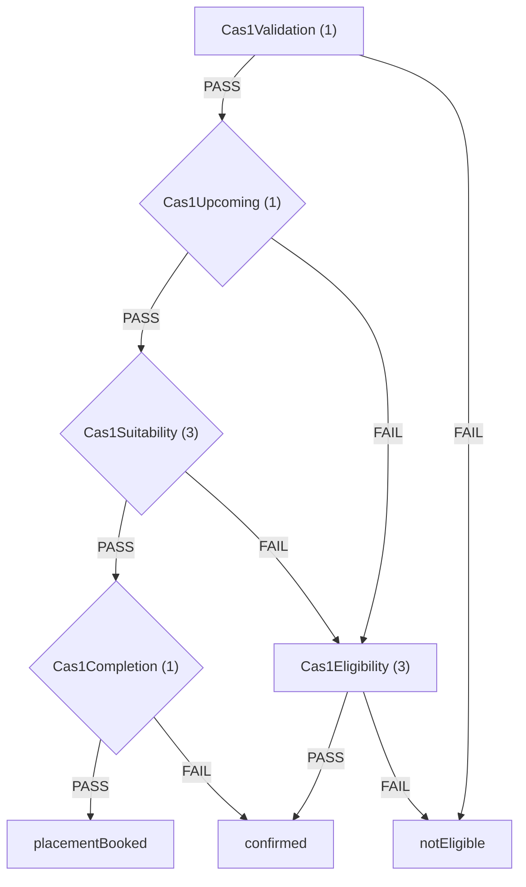
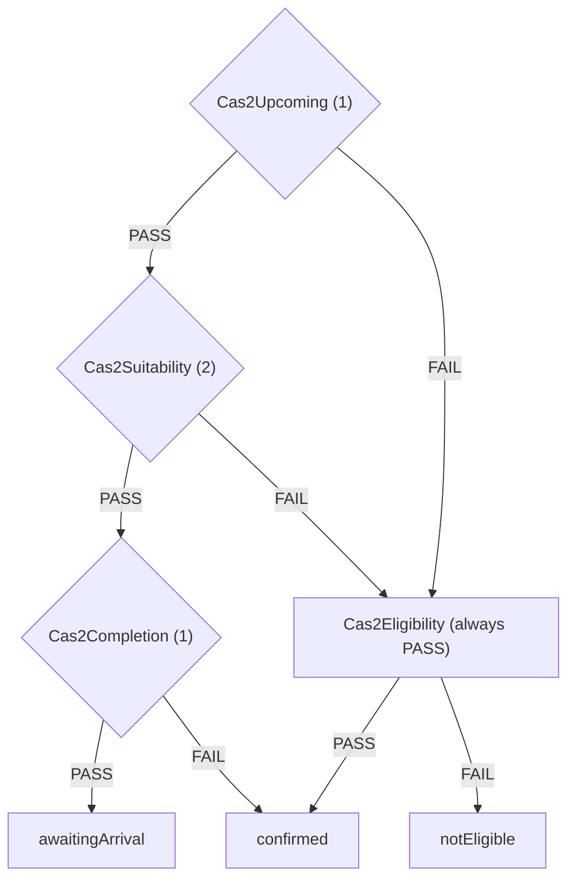
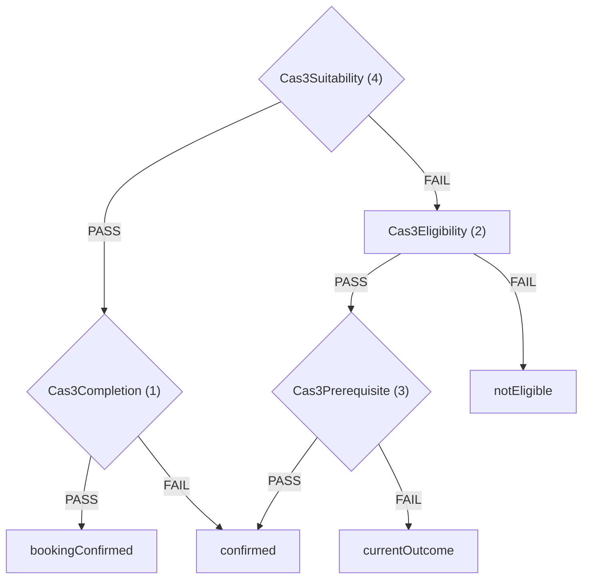
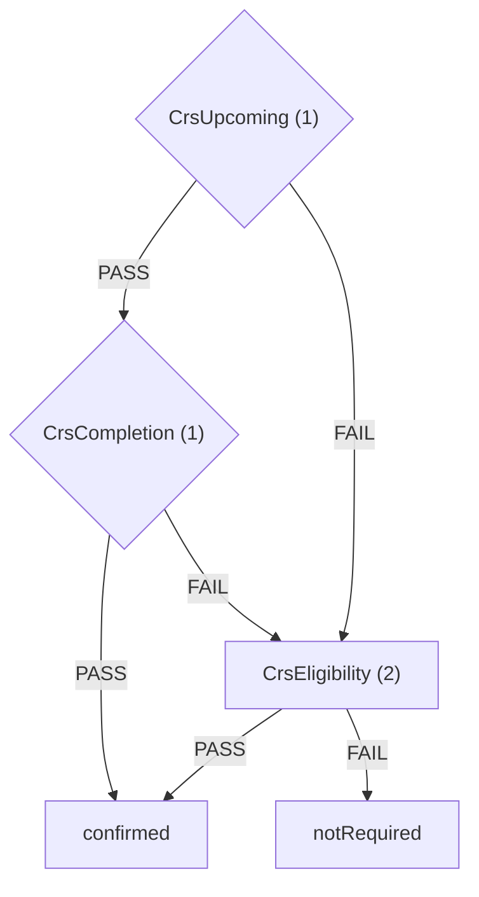
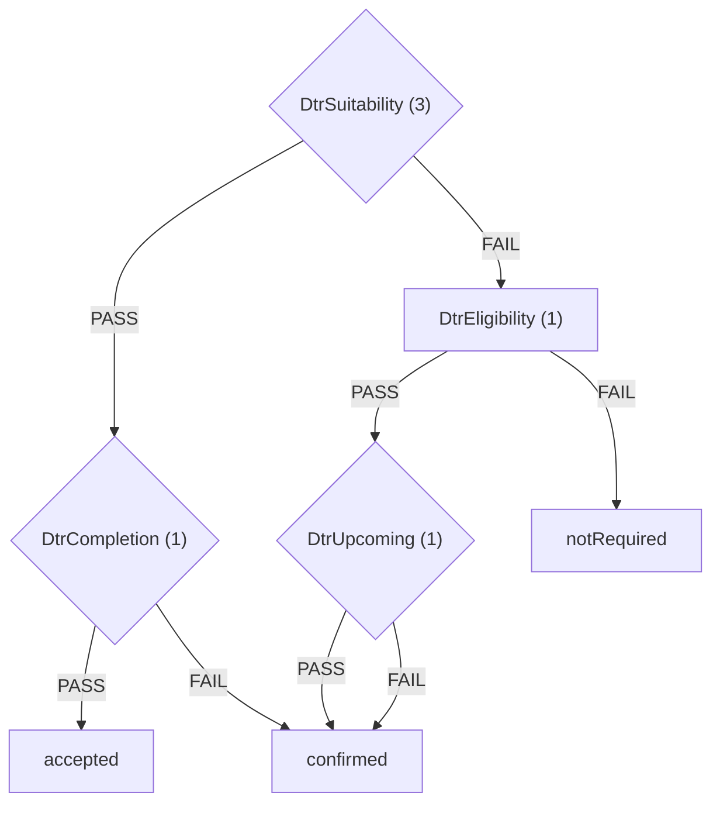
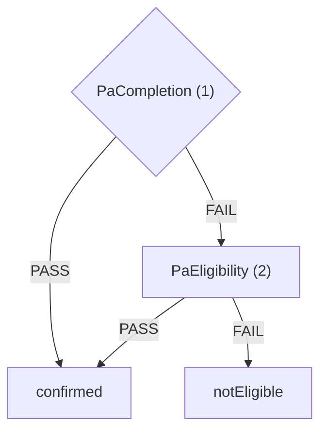

# Eligibility rules graph

Generated by `./gradlew :query:generateEligibilityRulesGraph`. Do not edit by hand.

Diamond RuleSet nodes have a FAIL context updater.

## CAS1

### Nodes

**Cas1Validation** (RuleSet)
- [`Cas1SexValidationRule`](../query/src/main/kotlin/uk/gov/justice/digital/hmpps/singleaccommodationserviceapi/query/eligibility/domain/cas1/validation/Cas1SexValidationRule.kt): FAIL if candidate has no sex

**Cas1Upcoming** (RuleSet)
- [`ReleaseWithinOneYearRule`](../query/src/main/kotlin/uk/gov/justice/digital/hmpps/singleaccommodationserviceapi/query/eligibility/domain/cas1/upcoming/ReleaseWithinOneYearRule.kt): FAIL if not within 1 year of release from current accommodation
- FAIL: [`Cas1UpcomingContextUpdater`](../query/src/main/kotlin/uk/gov/justice/digital/hmpps/singleaccommodationserviceapi/query/eligibility/domain/cas1/upcoming/Cas1UpcomingContextUpdater.kt) - Set Upcoming and start Approved Premise application

| Status | Action | Link type |
| --- | --- | --- |
| CAS1_UPCOMING | START_APPROVED_PREMISE_APPLICATION (CAS1) | - |

**Cas1Suitability** (RuleSet)
- [`Cas1ApplicationPresentRule`](../query/src/main/kotlin/uk/gov/justice/digital/hmpps/singleaccommodationserviceapi/query/eligibility/domain/cas1/suitability/Cas1ApplicationPresentRule.kt): FAIL if candidate does not have an application
- [`Cas1ApplicationRelevantExpiredRule`](../query/src/main/kotlin/uk/gov/justice/digital/hmpps/singleaccommodationserviceapi/query/eligibility/domain/cas1/suitability/Cas1ApplicationRelevantExpiredRule.kt): FAIL if expired application is not upcoming or arrived
- [`Cas1ApplicationSuitabilityRule`](../query/src/main/kotlin/uk/gov/justice/digital/hmpps/singleaccommodationserviceapi/query/eligibility/domain/cas1/suitability/Cas1ApplicationSuitabilityRule.kt): FAIL if candidate does not have a suitable application
- FAIL: [`Cas1SuitabilityContextUpdater`](../query/src/main/kotlin/uk/gov/justice/digital/hmpps/singleaccommodationserviceapi/query/eligibility/domain/cas1/suitability/Cas1SuitabilityContextUpdater.kt) - Set status from application

| Status | Action | Link type |
| --- | --- | --- |
| CAS1_NOT_SUBMITTED | CONTINUE_APPROVED_PREMISE_APPLICATION (CAS1) | CAS1_VIEW_APPLICATION |
| CAS1_APPLICATION_REJECTED | START_APPROVED_PREMISE_APPLICATION (CAS1) | CAS1_START_APPLICATION |
| CAS1_NOT_STARTED | START_APPROVED_PREMISE_APPLICATION (CAS1) | CAS1_START_APPLICATION |

**Cas1Completion** (RuleSet)
- [`Cas1ApplicationCompletionRule`](../query/src/main/kotlin/uk/gov/justice/digital/hmpps/singleaccommodationserviceapi/query/eligibility/domain/cas1/completion/Cas1ApplicationCompletionRule.kt): FAIL if placement is not upcoming
- FAIL: [`Cas1CompletionContextUpdater`](../query/src/main/kotlin/uk/gov/justice/digital/hmpps/singleaccommodationserviceapi/query/eligibility/domain/cas1/completion/Cas1CompletionContextUpdater.kt) - Set status from placement / request / application

| Status | Action | Link type |
| --- | --- | --- |
| CAS1_ARRIVED | - | CAS1_VIEW_APPLICATION |
| CAS1_NOT_ARRIVED | CREATE_PLACEMENT (CAS1) | CAS1_VIEW_APPLICATION |
| CAS1_PLACEMENT_CANCELLED | CREATE_PLACEMENT (CAS1) | CAS1_VIEW_APPLICATION |
| CAS1_PLACEMENT_REQUEST_NOT_STARTED | CREATE_PLACEMENT (CAS1) | CAS1_VIEW_APPLICATION |
| CAS1_PLACEMENT_REQUEST_WITHDRAWN | CREATE_PLACEMENT (CAS1) | CAS1_VIEW_APPLICATION |
| CAS1_PLACEMENT_REQUEST_NOT_STARTED | CREATE_PLACEMENT (CAS1) | CAS1_VIEW_APPLICATION |
| CAS1_PLACEMENT_REQUEST_REJECTED | CREATE_PLACEMENT (CAS1) | CAS1_VIEW_APPLICATION |
| CAS1_PLACEMENT_REQUEST_SUBMITTED | - | CAS1_VIEW_APPLICATION |
| CAS1_INFO_REQUESTED | PROVIDE_INFORMATION (CAS1) | CAS1_VIEW_APPLICATION |
| CAS1_SUBMITTED | - | CAS1_VIEW_APPLICATION |

**placementBooked** (Outcome)

**confirmed** (Outcome)

**Cas1Eligibility** (RuleSet)
- [`STierEligibilityRule`](../query/src/main/kotlin/uk/gov/justice/digital/hmpps/singleaccommodationserviceapi/query/eligibility/domain/cas1/eligibility/STierEligibilityRule.kt): FAIL if candidate is S Tier
- [`MaleRiskEligibilityRule`](../query/src/main/kotlin/uk/gov/justice/digital/hmpps/singleaccommodationserviceapi/query/eligibility/domain/cas1/eligibility/MaleRiskEligibilityRule.kt): FAIL if candidate is Male and is not Tier A3 - B1
- [`NonMaleRiskEligibilityRule`](../query/src/main/kotlin/uk/gov/justice/digital/hmpps/singleaccommodationserviceapi/query/eligibility/domain/cas1/eligibility/NonMaleRiskEligibilityRule.kt): FAIL if candidate is not Male and is not Tier A3 - C3

**notEligible** (Outcome)

## CAS2

### Nodes

**Cas2Upcoming** (RuleSet)
- [`ReleaseWithinOneYearRule`](../query/src/main/kotlin/uk/gov/justice/digital/hmpps/singleaccommodationserviceapi/query/eligibility/domain/cas1/upcoming/ReleaseWithinOneYearRule.kt): FAIL if not within 1 year of release from current accommodation
- FAIL: [`Cas2UpcomingContextUpdater`](../query/src/main/kotlin/uk/gov/justice/digital/hmpps/singleaccommodationserviceapi/query/eligibility/domain/cas2/upcoming/Cas2UpcomingContextUpdater.kt) - Set Upcoming and start CAS2 application

| Status | Action | Link type |
| --- | --- | --- |
| CAS2_UPCOMING | START_CAS2_REFERRAL (CAS2) | - |

**Cas2Suitability** (RuleSet)
- [`Cas2ApplicationSubmittedRule`](../query/src/main/kotlin/uk/gov/justice/digital/hmpps/singleaccommodationserviceapi/query/eligibility/domain/cas2/suitability/Cas2ApplicationSubmittedRule.kt): FAIL if candidate does not have a submitted application
- [`Cas2SuitableStatusRule`](../query/src/main/kotlin/uk/gov/justice/digital/hmpps/singleaccommodationserviceapi/query/eligibility/domain/cas2/suitability/Cas2SuitableStatusRule.kt): FAIL if candidate has an unsuitable status
- FAIL: [`Cas2SuitabilityContextUpdater`](../query/src/main/kotlin/uk/gov/justice/digital/hmpps/singleaccommodationserviceapi/query/eligibility/domain/cas2/suitability/Cas2SuitabilityContextUpdater.kt) - Set Not started and start CAS2 application

| Status | Action | Link type |
| --- | --- | --- |
| CAS2_NOT_STARTED | START_CAS2_REFERRAL (CAS2) | CAS2_START_APPLICATION |
| CAS2_NOT_SUBMITTED | CONTINUE_A_CAS2_REFERRAL (CAS2) | CAS2_VIEW_APPLICATION |
| CAS2_OFFER_DECLINED_OR_WITHDRAWN | - | CAS2_START_APPLICATION |
| CAS2_CANCELLED | - | CAS2_START_APPLICATION |
| CAS2_WITHDRAWN | - | CAS2_START_APPLICATION |
| CAS2_UNKNOWN | - | - |

**Cas2Completion** (RuleSet)
- [`Cas2ApplicationAwaitingArrivalRule`](../query/src/main/kotlin/uk/gov/justice/digital/hmpps/singleaccommodationserviceapi/query/eligibility/domain/cas2/completion/Cas2ApplicationAwaitingArrivalRule.kt): FAIL if application is not awaiting arrival
- FAIL: [`Cas2CompletionContextUpdater`](../query/src/main/kotlin/uk/gov/justice/digital/hmpps/singleaccommodationserviceapi/query/eligibility/domain/cas2/completion/Cas2CompletionContextUpdater.kt) - Set Started and continue CAS2 application

| Status | Action | Link type |
| --- | --- | --- |
| CAS2_SUBMITTED | - | CAS2_VIEW_APPLICATION |
| CAS2_MORE_INFORMATION_NEEDED | PROVIDE_MORE_INFORMATION_FOR_CAS2_REFERRAL (CAS2) | CAS2_VIEW_APPLICATION |
| CAS2_AWAITING_DECISION | - | CAS2_VIEW_APPLICATION |
| CAS2_ON_WAITING_LIST | - | CAS2_VIEW_APPLICATION |
| CAS2_PLACE_OFFERED | REPLY_TO_CAS2_PLACE_OFFER (CAS2) | CAS2_VIEW_APPLICATION |
| CAS2_OFFER_ACCEPTED | - | CAS2_VIEW_APPLICATION |
| CAS2_UNKNOWN | - | - |

**awaitingArrival** (Outcome)

**confirmed** (Outcome)

**Cas2Eligibility** (RuleSet)
- (no rules - always PASS)

**notEligible** (Outcome)

## CAS3

### Nodes

**Cas3Suitability** (RuleSet)
- [`Cas3ApplicationSuitabilityRule`](../query/src/main/kotlin/uk/gov/justice/digital/hmpps/singleaccommodationserviceapi/query/eligibility/domain/cas3/suitability/Cas3ApplicationSuitabilityRule.kt): FAIL if CAS3 application is not suitable
- [`Cas3ApplicationPresentSuitabilityRule`](../query/src/main/kotlin/uk/gov/justice/digital/hmpps/singleaccommodationserviceapi/query/eligibility/domain/cas3/suitability/Cas3ApplicationPresentSuitabilityRule.kt): FAIL if CAS3 application is not present
- [`Cas3BookingSuitabilityRule`](../query/src/main/kotlin/uk/gov/justice/digital/hmpps/singleaccommodationserviceapi/query/eligibility/domain/cas3/suitability/Cas3BookingSuitabilityRule.kt): FAIL if booking is arrived, departed or closed
- [`Cas3AssessmentSuitabilityRule`](../query/src/main/kotlin/uk/gov/justice/digital/hmpps/singleaccommodationserviceapi/query/eligibility/domain/cas3/suitability/Cas3AssessmentSuitabilityRule.kt): FAIL if CAS3 assessment is rejected or closed
- FAIL: [`Cas3SuitabilityContextUpdater`](../query/src/main/kotlin/uk/gov/justice/digital/hmpps/singleaccommodationserviceapi/query/eligibility/domain/cas3/suitability/Cas3SuitabilityContextUpdater.kt) - Set status from referral

| Status | Action | Link type |
| --- | --- | --- |
| CAS3_NOT_STARTED | START_CAS3_REFERRAL (CAS3) | CAS3_START_REFERRAL |
| CAS3_REJECTED | START_CAS3_REFERRAL (CAS3) | CAS3_START_REFERRAL |
| CAS3_NOT_SUBMITTED | CONTINUE_CAS3_REFERRAL (CAS3) | CAS3_VIEW_REFERRAL |
| CAS3_NOT_STARTED | START_CAS3_REFERRAL (CAS3) | CAS3_START_REFERRAL |

**Cas3Completion** (RuleSet)
- [`Cas3ApplicationConfirmedRule`](../query/src/main/kotlin/uk/gov/justice/digital/hmpps/singleaccommodationserviceapi/query/eligibility/domain/cas3/completion/Cas3ApplicationConfirmedRule.kt): FAIL if CAS3 application is not confirmed
- FAIL: [`Cas3CompletionContextUpdater`](../query/src/main/kotlin/uk/gov/justice/digital/hmpps/singleaccommodationserviceapi/query/eligibility/domain/cas3/completion/Cas3CompletionContextUpdater.kt) - Set status from booking

| Status | Action | Link type |
| --- | --- | --- |
| CAS3_BEDSPACE_OFFERED | REPLY_TO_CAS3_BEDSPACE_OFFER (CAS3) | CAS3_VIEW_REFERRAL |
| CAS3_BOOKING_CONFIRMED | - | CAS3_VIEW_REFERRAL |
| CAS3_NOT_ARRIVED | - | CAS3_VIEW_REFERRAL |
| CAS3_BOOKING_CANCELLED | - | CAS3_VIEW_REFERRAL |
| CAS3_SUBMITTED | - | CAS3_VIEW_REFERRAL |

**bookingConfirmed** (Outcome)

**confirmed** (Outcome)

**Cas3Eligibility** (RuleSet)
- [`CurrentAccommodationTypeRule`](../query/src/main/kotlin/uk/gov/justice/digital/hmpps/singleaccommodationserviceapi/query/eligibility/domain/cas3/eligibility/CurrentAccommodationTypeRule.kt): FAIL if current accommodation is not Approved Premise (CAS1), CAS2, or Prison
- [`NoNextAccommodationRule`](../query/src/main/kotlin/uk/gov/justice/digital/hmpps/singleaccommodationserviceapi/query/eligibility/domain/accommodation/NoNextAccommodationRule.kt): FAIL if candidate has next accommodation

**Cas3Prerequisite** (RuleSet)
- [`DtrExpiredReferralRule`](../query/src/main/kotlin/uk/gov/justice/digital/hmpps/singleaccommodationserviceapi/query/eligibility/domain/dtr/DtrExpiredReferralRule.kt): FAIL if DTR is submitted more than 26 weeks ago.
- [`CrsSubmittedRuleMale`](../query/src/main/kotlin/uk/gov/justice/digital/hmpps/singleaccommodationserviceapi/query/eligibility/domain/cas3/prerequisite/CrsSubmittedRuleMale.kt): FAIL if CRS not submitted and male
- [`CrsSubmittedRuleNonMale`](../query/src/main/kotlin/uk/gov/justice/digital/hmpps/singleaccommodationserviceapi/query/eligibility/domain/cas3/prerequisite/CrsSubmittedRuleNonMale.kt): FAIL if CRS not submitted and not male
- FAIL: [`Cas3PrerequisiteContextUpdater`](../query/src/main/kotlin/uk/gov/justice/digital/hmpps/singleaccommodationserviceapi/query/eligibility/domain/cas3/prerequisite/Cas3PrerequisiteContextUpdater.kt) - Set Cannot start yet from outstanding DTR/CRS

| Status | Action | Link type | Blocking reason |
| --- | --- | --- | --- |
| CAS3_CANNOT_START_YET | - | - | SUBMIT_DTR_AND_CRS_ACCOMMODATION_BEFORE_CAS3 |
| CAS3_CANNOT_START_YET | - | - | SUBMIT_DTR_AND_CRS_BEFORE_CAS3 |
| CAS3_CANNOT_START_YET | - | - | SUBMIT_CRS_ACCOMMODATION_BEFORE_CAS3 |
| CAS3_CANNOT_START_YET | - | - | SUBMIT_CRS_BEFORE_CAS3 |
| CAS3_CANNOT_START_YET | - | - | SUBMIT_DTR_BEFORE_CAS3 |

**currentOutcome** (Outcome)

**notEligible** (Outcome)

## CRS

### Nodes

**CrsUpcoming** (RuleSet)
- [`CrsUpcomingRule`](../query/src/main/kotlin/uk/gov/justice/digital/hmpps/singleaccommodationserviceapi/query/eligibility/domain/crs/upcoming/CrsUpcomingRule.kt): FAIL if not within 12 weeks of release from current accommodation
- FAIL: [`CrsUpcomingContextUpdater`](../query/src/main/kotlin/uk/gov/justice/digital/hmpps/singleaccommodationserviceapi/query/eligibility/domain/crs/upcoming/CrsUpcomingContextUpdater.kt) - Set Upcoming and submit CRS referral

| Status | Action | Link type |
| --- | --- | --- |
| CRS_UPCOMING_ACCOMMODATION_REFERRAL | SUBMIT_CRS_ACCOMMODATION_REFERRAL (CRS) | - |
| CRS_UPCOMING_REFERRAL | SUBMIT_CRS_REFERRAL (CRS) | - |

**CrsCompletion** (RuleSet)
- [`CrsSubmittedRule`](../query/src/main/kotlin/uk/gov/justice/digital/hmpps/singleaccommodationserviceapi/query/eligibility/domain/crs/CrsSubmittedRule.kt): FAIL if no live CRS referral
- FAIL: [`CrsCompletionContextUpdater`](../query/src/main/kotlin/uk/gov/justice/digital/hmpps/singleaccommodationserviceapi/query/eligibility/domain/crs/completion/CrsCompletionContextUpdater.kt) - Set Not started and submit CRS referral

| Status | Action | Link type |
| --- | --- | --- |
| CRS_NOT_STARTED_ACCOMMODATION_REFERRAL | SUBMIT_CRS_ACCOMMODATION_REFERRAL (CRS) | - |
| CRS_NOT_STARTED_REFERRAL | SUBMIT_CRS_REFERRAL (CRS) | - |

**confirmed** (Outcome)

**CrsEligibility** (RuleSet)
- [`NoNextAccommodationRule`](../query/src/main/kotlin/uk/gov/justice/digital/hmpps/singleaccommodationserviceapi/query/eligibility/domain/accommodation/NoNextAccommodationRule.kt): FAIL if candidate has next accommodation
- [`IsSettledRule`](../query/src/main/kotlin/uk/gov/justice/digital/hmpps/singleaccommodationserviceapi/query/eligibility/domain/crs/eligibility/IsSettledRule.kt): FAIL if candidate is settled

**notRequired** (Outcome)

## DTR

### Nodes

**DtrSuitability** (RuleSet)
- [`DtrPresentRule`](../query/src/main/kotlin/uk/gov/justice/digital/hmpps/singleaccommodationserviceapi/query/eligibility/domain/dtr/suitability/DtrPresentRule.kt): FAIL if DTR status is not present
- [`DtrNotWithdrawnRule`](../query/src/main/kotlin/uk/gov/justice/digital/hmpps/singleaccommodationserviceapi/query/eligibility/domain/dtr/suitability/DtrNotWithdrawnRule.kt): FAIL if DTR referral has been withdrawn
- [`DtrExpiredReferralRule`](../query/src/main/kotlin/uk/gov/justice/digital/hmpps/singleaccommodationserviceapi/query/eligibility/domain/dtr/DtrExpiredReferralRule.kt): FAIL if DTR is submitted more than 26 weeks ago.
- FAIL: Set DTR_NOT_STARTED

| Status | Action | Link type |
| --- | --- | --- |
| DTR_NOT_STARTED | ADD_DTR_REFERRAL_DETAILS (DTR) | - |

**DtrCompletion** (RuleSet)
- [`DtrApplicationCompleteRule`](../query/src/main/kotlin/uk/gov/justice/digital/hmpps/singleaccommodationserviceapi/query/eligibility/domain/dtr/completion/DtrApplicationCompleteRule.kt): FAIL if DTR not accepted
- FAIL: [`DtrCompletionContextUpdater`](../query/src/main/kotlin/uk/gov/justice/digital/hmpps/singleaccommodationserviceapi/query/eligibility/domain/dtr/completion/DtrCompletionContextUpdater.kt) - Set status from DTR

| Status | Action | Link type |
| --- | --- | --- |
| DTR_NOT_ACCEPTED | - | - |
| DTR_SUBMITTED | ADD_DTR_OUTCOME (DTR) | - |

**accepted** (Outcome)

**confirmed** (Outcome)

**DtrEligibility** (RuleSet)
- [`NoNextAccommodationRule`](../query/src/main/kotlin/uk/gov/justice/digital/hmpps/singleaccommodationserviceapi/query/eligibility/domain/accommodation/NoNextAccommodationRule.kt): FAIL if candidate has next accommodation

**DtrUpcoming** (RuleSet)
- [`ReleaseWithinEightWeeksRule`](../query/src/main/kotlin/uk/gov/justice/digital/hmpps/singleaccommodationserviceapi/query/eligibility/domain/dtr/upcoming/ReleaseWithinEightWeeksRule.kt): FAIL if not within 8 weeks of release from current accommodation
- FAIL: [`DtrUpcomingContextUpdater`](../query/src/main/kotlin/uk/gov/justice/digital/hmpps/singleaccommodationserviceapi/query/eligibility/domain/dtr/upcoming/DtrUpcomingContextUpdater.kt) - Set Upcoming and submit DTR referral

| Status | Action | Link type |
| --- | --- | --- |
| DTR_UPCOMING | SUBMIT_DTR_REFERRAL (DTR) | - |

**notRequired** (Outcome)

## PA

### Nodes

**PaCompletion** (RuleSet)
- [`HasNextAccommodationRule`](../query/src/main/kotlin/uk/gov/justice/digital/hmpps/singleaccommodationserviceapi/query/eligibility/domain/pa/completion/HasNextAccommodationRule.kt): FAIL if candidate has no next accommodation
- FAIL: Set PA_NOT_STARTED

| Status | Action | Link type |
| --- | --- | --- |
| PA_NOT_STARTED | ADD_AND_CONFIRM_PROPOSED_ADDRESS (PA) | - |

**confirmed** (Outcome)

**PaEligibility** (RuleSet)
- [`Cas1ApplicationNotSuitableRule`](../query/src/main/kotlin/uk/gov/justice/digital/hmpps/singleaccommodationserviceapi/query/eligibility/domain/pa/eligibility/Cas1ApplicationNotSuitableRule.kt): FAIL if candidate has a suitable CAS1 application
- [`Cas3ApplicationNotSuitableRule`](../query/src/main/kotlin/uk/gov/justice/digital/hmpps/singleaccommodationserviceapi/query/eligibility/domain/pa/eligibility/Cas3ApplicationNotSuitableRule.kt): FAIL if candidate has suitable CAS3 application

**notEligible** (Outcome)

## Rule catalogue

| Rule | Description | RuleSets | Trees |
| --- | --- | --- | --- |
| Cas1ApplicationCompletionRule | FAIL if placement is not upcoming | Cas1Completion | CAS1 |
| Cas1ApplicationNotSuitableRule | FAIL if candidate has a suitable CAS1 application | PaEligibility | PA |
| Cas1ApplicationPresentRule | FAIL if candidate does not have an application | Cas1Suitability | CAS1 |
| Cas1ApplicationRelevantExpiredRule | FAIL if expired application is not upcoming or arrived | Cas1Suitability | CAS1 |
| Cas1ApplicationSuitabilityRule | FAIL if candidate does not have a suitable application | Cas1Suitability | CAS1 |
| Cas1SexValidationRule | FAIL if candidate has no sex | Cas1Validation | CAS1 |
| Cas2ApplicationAwaitingArrivalRule | FAIL if application is not awaiting arrival | Cas2Completion | CAS2 |
| Cas2ApplicationSubmittedRule | FAIL if candidate does not have a submitted application | Cas2Suitability | CAS2 |
| Cas2SuitableStatusRule | FAIL if candidate has an unsuitable status | Cas2Suitability | CAS2 |
| Cas3ApplicationConfirmedRule | FAIL if CAS3 application is not confirmed | Cas3Completion | CAS3 |
| Cas3ApplicationNotSuitableRule | FAIL if candidate has suitable CAS3 application | PaEligibility | PA |
| Cas3ApplicationPresentSuitabilityRule | FAIL if CAS3 application is not present | Cas3Suitability | CAS3 |
| Cas3ApplicationSuitabilityRule | FAIL if CAS3 application is not suitable | Cas3Suitability | CAS3 |
| Cas3AssessmentSuitabilityRule | FAIL if CAS3 assessment is rejected or closed | Cas3Suitability | CAS3 |
| Cas3BookingSuitabilityRule | FAIL if booking is arrived, departed or closed | Cas3Suitability | CAS3 |
| CrsSubmittedRule | FAIL if no live CRS referral | CrsCompletion | CRS |
| CrsSubmittedRuleMale | FAIL if CRS not submitted and male | Cas3Prerequisite | CAS3 |
| CrsSubmittedRuleNonMale | FAIL if CRS not submitted and not male | Cas3Prerequisite | CAS3 |
| CrsUpcomingRule | FAIL if not within 12 weeks of release from current accommodation | CrsUpcoming | CRS |
| CurrentAccommodationTypeRule | FAIL if current accommodation is not Approved Premise (CAS1), CAS2, or Prison | Cas3Eligibility | CAS3 |
| DtrApplicationCompleteRule | FAIL if DTR not accepted | DtrCompletion | DTR |
| DtrExpiredReferralRule | FAIL if DTR is submitted more than 26 weeks ago. | Cas3Prerequisite, DtrSuitability | CAS3, DTR |
| DtrNotWithdrawnRule | FAIL if DTR referral has been withdrawn | DtrSuitability | DTR |
| DtrPresentRule | FAIL if DTR status is not present | DtrSuitability | DTR |
| HasNextAccommodationRule | FAIL if candidate has no next accommodation | PaCompletion | PA |
| IsSettledRule | FAIL if candidate is settled | CrsEligibility | CRS |
| MaleRiskEligibilityRule | FAIL if candidate is Male and is not Tier A3 - B1 | Cas1Eligibility | CAS1 |
| NoNextAccommodationRule | FAIL if candidate has next accommodation | Cas3Eligibility, CrsEligibility, DtrEligibility | CAS3, CRS, DTR |
| NonMaleRiskEligibilityRule | FAIL if candidate is not Male and is not Tier A3 - C3 | Cas1Eligibility | CAS1 |
| ReleaseWithinEightWeeksRule | FAIL if not within 8 weeks of release from current accommodation | DtrUpcoming | DTR |
| ReleaseWithinOneYearRule | FAIL if not within 1 year of release from current accommodation | Cas1Upcoming, Cas2Upcoming | CAS1, CAS2 |
| STierEligibilityRule | FAIL if candidate is S Tier | Cas1Eligibility | CAS1 |

## Context updater catalogue

Set status from placement / request / application

Used by: Cas1Completion (CAS1)

| Status | Action | Link type |
| --- | --- | --- |
| CAS1_ARRIVED | - | CAS1_VIEW_APPLICATION |
| CAS1_NOT_ARRIVED | CREATE_PLACEMENT (CAS1) | CAS1_VIEW_APPLICATION |
| CAS1_PLACEMENT_CANCELLED | CREATE_PLACEMENT (CAS1) | CAS1_VIEW_APPLICATION |
| CAS1_PLACEMENT_REQUEST_NOT_STARTED | CREATE_PLACEMENT (CAS1) | CAS1_VIEW_APPLICATION |
| CAS1_PLACEMENT_REQUEST_WITHDRAWN | CREATE_PLACEMENT (CAS1) | CAS1_VIEW_APPLICATION |
| CAS1_PLACEMENT_REQUEST_NOT_STARTED | CREATE_PLACEMENT (CAS1) | CAS1_VIEW_APPLICATION |
| CAS1_PLACEMENT_REQUEST_REJECTED | CREATE_PLACEMENT (CAS1) | CAS1_VIEW_APPLICATION |
| CAS1_PLACEMENT_REQUEST_SUBMITTED | - | CAS1_VIEW_APPLICATION |
| CAS1_INFO_REQUESTED | PROVIDE_INFORMATION (CAS1) | CAS1_VIEW_APPLICATION |
| CAS1_SUBMITTED | - | CAS1_VIEW_APPLICATION |

Set status from application

Used by: Cas1Suitability (CAS1)

| Status | Action | Link type |
| --- | --- | --- |
| CAS1_NOT_SUBMITTED | CONTINUE_APPROVED_PREMISE_APPLICATION (CAS1) | CAS1_VIEW_APPLICATION |
| CAS1_APPLICATION_REJECTED | START_APPROVED_PREMISE_APPLICATION (CAS1) | CAS1_START_APPLICATION |
| CAS1_NOT_STARTED | START_APPROVED_PREMISE_APPLICATION (CAS1) | CAS1_START_APPLICATION |

Set Upcoming and start Approved Premise application

Used by: Cas1Upcoming (CAS1)

| Status | Action | Link type |
| --- | --- | --- |
| CAS1_UPCOMING | START_APPROVED_PREMISE_APPLICATION (CAS1) | - |

Set Started and continue CAS2 application

Used by: Cas2Completion (CAS2)

| Status | Action | Link type |
| --- | --- | --- |
| CAS2_SUBMITTED | - | CAS2_VIEW_APPLICATION |
| CAS2_MORE_INFORMATION_NEEDED | PROVIDE_MORE_INFORMATION_FOR_CAS2_REFERRAL (CAS2) | CAS2_VIEW_APPLICATION |
| CAS2_AWAITING_DECISION | - | CAS2_VIEW_APPLICATION |
| CAS2_ON_WAITING_LIST | - | CAS2_VIEW_APPLICATION |
| CAS2_PLACE_OFFERED | REPLY_TO_CAS2_PLACE_OFFER (CAS2) | CAS2_VIEW_APPLICATION |
| CAS2_OFFER_ACCEPTED | - | CAS2_VIEW_APPLICATION |
| CAS2_UNKNOWN | - | - |

Set Not started and start CAS2 application

Used by: Cas2Suitability (CAS2)

| Status | Action | Link type |
| --- | --- | --- |
| CAS2_NOT_STARTED | START_CAS2_REFERRAL (CAS2) | CAS2_START_APPLICATION |
| CAS2_NOT_SUBMITTED | CONTINUE_A_CAS2_REFERRAL (CAS2) | CAS2_VIEW_APPLICATION |
| CAS2_OFFER_DECLINED_OR_WITHDRAWN | - | CAS2_START_APPLICATION |
| CAS2_CANCELLED | - | CAS2_START_APPLICATION |
| CAS2_WITHDRAWN | - | CAS2_START_APPLICATION |
| CAS2_UNKNOWN | - | - |

Set Upcoming and start CAS2 application

Used by: Cas2Upcoming (CAS2)

| Status | Action | Link type |
| --- | --- | --- |
| CAS2_UPCOMING | START_CAS2_REFERRAL (CAS2) | - |

Set status from booking

Used by: Cas3Completion (CAS3)

| Status | Action | Link type |
| --- | --- | --- |
| CAS3_BEDSPACE_OFFERED | REPLY_TO_CAS3_BEDSPACE_OFFER (CAS3) | CAS3_VIEW_REFERRAL |
| CAS3_BOOKING_CONFIRMED | - | CAS3_VIEW_REFERRAL |
| CAS3_NOT_ARRIVED | - | CAS3_VIEW_REFERRAL |
| CAS3_BOOKING_CANCELLED | - | CAS3_VIEW_REFERRAL |
| CAS3_SUBMITTED | - | CAS3_VIEW_REFERRAL |

Set Cannot start yet from outstanding DTR/CRS

Used by: Cas3Prerequisite (CAS3)

| Status | Action | Link type | Blocking reason |
| --- | --- | --- | --- |
| CAS3_CANNOT_START_YET | - | - | SUBMIT_DTR_AND_CRS_ACCOMMODATION_BEFORE_CAS3 |
| CAS3_CANNOT_START_YET | - | - | SUBMIT_DTR_AND_CRS_BEFORE_CAS3 |
| CAS3_CANNOT_START_YET | - | - | SUBMIT_CRS_ACCOMMODATION_BEFORE_CAS3 |
| CAS3_CANNOT_START_YET | - | - | SUBMIT_CRS_BEFORE_CAS3 |
| CAS3_CANNOT_START_YET | - | - | SUBMIT_DTR_BEFORE_CAS3 |

Set status from referral

Used by: Cas3Suitability (CAS3)

| Status | Action | Link type |
| --- | --- | --- |
| CAS3_NOT_STARTED | START_CAS3_REFERRAL (CAS3) | CAS3_START_REFERRAL |
| CAS3_REJECTED | START_CAS3_REFERRAL (CAS3) | CAS3_START_REFERRAL |
| CAS3_NOT_SUBMITTED | CONTINUE_CAS3_REFERRAL (CAS3) | CAS3_VIEW_REFERRAL |
| CAS3_NOT_STARTED | START_CAS3_REFERRAL (CAS3) | CAS3_START_REFERRAL |

Set Not started and submit CRS referral

Used by: CrsCompletion (CRS)

| Status | Action | Link type |
| --- | --- | --- |
| CRS_NOT_STARTED_ACCOMMODATION_REFERRAL | SUBMIT_CRS_ACCOMMODATION_REFERRAL (CRS) | - |
| CRS_NOT_STARTED_REFERRAL | SUBMIT_CRS_REFERRAL (CRS) | - |

Set Upcoming and submit CRS referral

Used by: CrsUpcoming (CRS)

| Status | Action | Link type |
| --- | --- | --- |
| CRS_UPCOMING_ACCOMMODATION_REFERRAL | SUBMIT_CRS_ACCOMMODATION_REFERRAL (CRS) | - |
| CRS_UPCOMING_REFERRAL | SUBMIT_CRS_REFERRAL (CRS) | - |

Set status from DTR

Used by: DtrCompletion (DTR)

| Status | Action | Link type |
| --- | --- | --- |
| DTR_NOT_ACCEPTED | - | - |
| DTR_SUBMITTED | ADD_DTR_OUTCOME (DTR) | - |

Set Upcoming and submit DTR referral

Used by: DtrUpcoming (DTR)

| Status | Action | Link type |
| --- | --- | --- |
| DTR_UPCOMING | SUBMIT_DTR_REFERRAL (DTR) | - |

Set DTR_NOT_STARTED

Used by: DtrSuitability (DTR)

| Status | Action | Link type |
| --- | --- | --- |
| DTR_NOT_STARTED | ADD_DTR_REFERRAL_DETAILS (DTR) | - |

Set PA_NOT_STARTED

Used by: PaCompletion (PA)

| Status | Action | Link type |
| --- | --- | --- |
| PA_NOT_STARTED | ADD_AND_CONFIRM_PROPOSED_ADDRESS (PA) | - |

