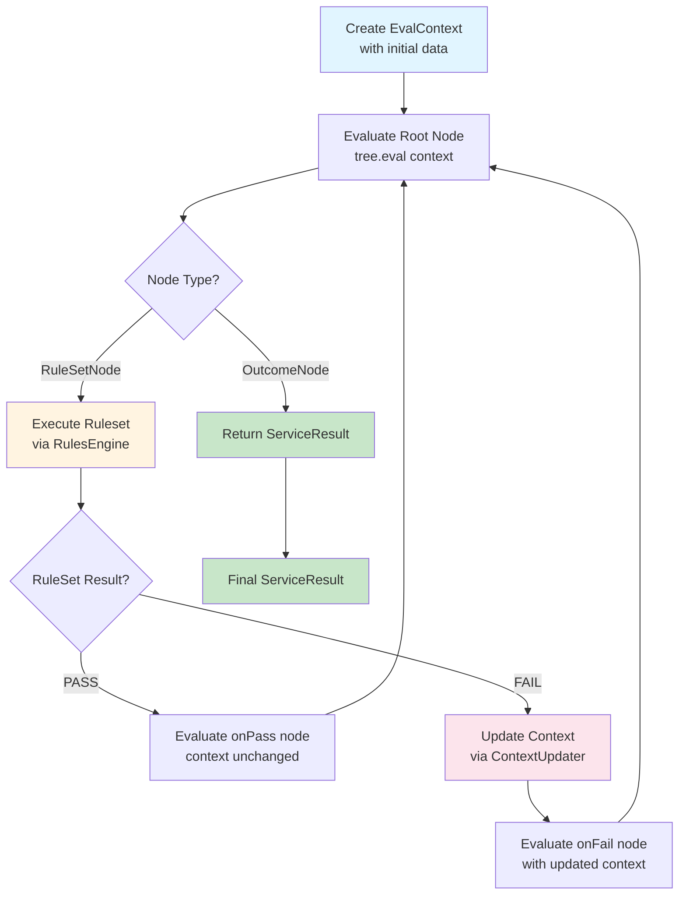
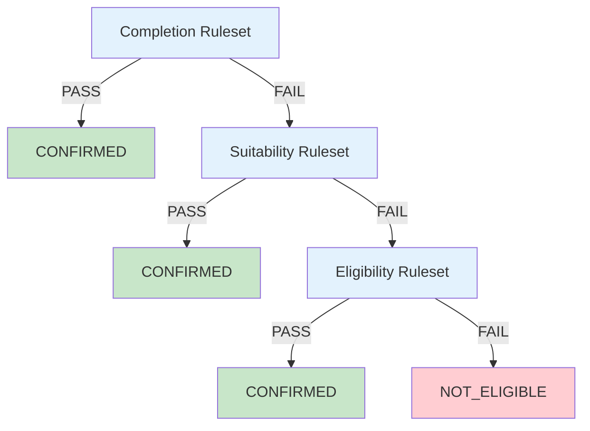

# Decision Tree Model

A declarative, clean architecture for evaluating eligibility rules using an explicit decision tree pattern. With an attempt to separate 
- orchestration
- execution
- and analysis concerns 

The goal being to make rule evaluation, testable, and extensible

## Overview

The decision was made to favour an explicit tree structure over a recursive model because:
- **Developers can focus on building logical nodes and outcomes**
- **Each node executes a ruleset and explicity branches based on results**
- **Context updates are separated from tree traversal, seperating node outcome from context update**

## Key Concepts

### Decision Tree Structure

A decision tree is composed of two types of nodes:

1. **RuleSetNode**: Executes a ruleset and branches to different nodes based on PASS/FAIL
2. **OutcomeNode**: Terminal node that returns a final `ServiceResult`

### Evaluation Context

`EvalContext` carries state through tree traversal:
- `data`: The domain data (prisoner info, applications, etc.)
- `current`: The current best-known `ServiceResult` (status, actions, application ID) etc

### Context Updaters

`ContextUpdater` implementations handle the analysis/mapping logic:
- Transform `RuleSetResult` into updated `ServiceResult`
- Extract business logic from tree traversal

## How It Works

### Tree Evaluation Flow



**Step-by-step process:**

1. **Start**: Create `EvalContext` with initial domain data and default `ServiceResult`
2. **Evaluate Root Node**: Call `tree.eval(initialContext)`
3. **RuleSetNode Execution**:
    - Execute ruleset using `RulesEngine`
    - If **PASS**: Evaluate `onPass` node with current context (unchanged)
    - If **FAIL**: Update context using `ContextUpdater`, then evaluate `onFail` node
4. **OutcomeNode**: Return final `ServiceResult`

### Example: CAS1 Tree Structure



## Usage Examples

### Building a Chain Tree (CAS1)

```kotlin
val treeBuilder = DecisionTreeBuilder(engine)
val contextUpdater = Cas1ContextUpdater()

val confirmed = treeBuilder.confirmed()
val notEligible = treeBuilder.notEligible()

// Build from bottom up (last → first)
val eligibility = treeBuilder
    .ruleSet("Cas1Eligibility", eligibilityRuleSet, contextUpdater)
    .onPass(confirmed)
    .onFail(notEligible)
    .build()

val suitability = treeBuilder
    .ruleSet("Cas1Suitability", suitabilityRuleSet, contextUpdater)
    .onPass(confirmed)
    .onFail(eligibility) 
    .build()

val tree = treeBuilder
    .ruleSet("Cas1Completion", completionRuleSet, contextUpdater)
    .onPass(confirmed)
    .onFail(suitability) 
    .build()
```

### Custom Outcome

```kotlin
val customOutcome = treeBuilder.outcome(
    ServiceResult(
        serviceStatus = ServiceStatus.REJECTED,
        suitableApplicationId = null,
        actions = listOf(RuleAction("Something", false))
    )
)

val tree = treeBuilder
    .ruleSet("MyRuleSet", myRuleSet, myContextUpdater)
    .onPass(customOutcome)
    .onFail(treeBuilder.notEligible())
    .build()
```

## Design Decisions

### PASS vs FAIL Behavior

Context is only updated when a ruleset fails. This ensures:
- PASS results return immediately with the current "best known" state
- FAIL results update state before continuing to next ruleset